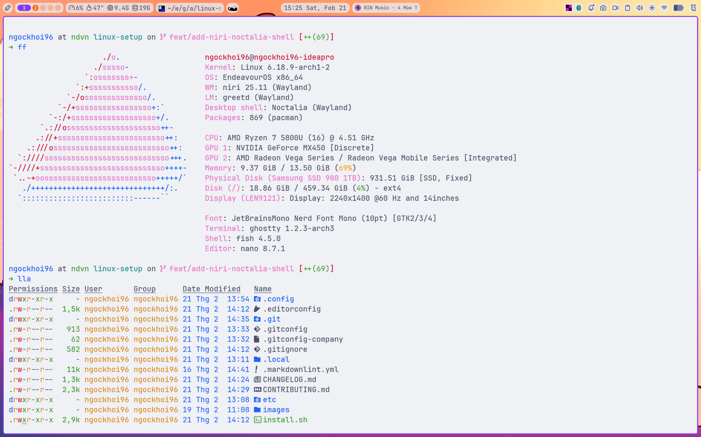

# Linux Setup

[](https://github.com/anIcedAntFA/linux-setup/actions/workflows/ci.yml)
[](LICENSE)
[](https://www.chezmoi.io/)

My personal Linux dotfiles — an [EndeavourOS](https://endeavouros.com/) (Arch)
desktop built on the [niri](https://github.com/YaLTeR/niri) scrollable-tiling
Wayland compositor and the [Noctalia](https://github.com/noctalia-dev/noctalia-shell)
shell, managed with [chezmoi](https://www.chezmoi.io/) so it's reproducible on a
fresh machine and safe to share publicly.

<!-- TODO: replace with a current desktop screenshot (niri + Noctalia). -->
<!--  -->



> [!NOTE]
> This is tuned for **my personal laptop**. Read each config before applying it —
> don't copy blindly. Everything private (emails, work host, hostnames) is
> templated, so you supply your own values on first run.

## Table of contents

- [Linux Setup](#linux-setup)
  - [Table of contents](#table-of-contents)
  - [What I use](#what-i-use)
  - [Quick start](#quick-start)
  - [How it's organized](#how-its-organized)
  - [Guides](#guides)
  - [Packages](#packages)
  - [Development](#development)
  - [Credits](#credits)
  - [License](#license)

## What I use

| Layer               | Choice                                                                              |
| ------------------- | ----------------------------------------------------------------------------------- |
| **Distro**          | [EndeavourOS](https://endeavouros.com/) (Arch-based), "no desktop" base             |
| **AUR helper**      | [yay](https://github.com/Jguer/yay)                                                 |
| **Compositor**      | [niri](https://github.com/YaLTeR/niri) — scrollable tiling, Wayland                 |
| **Shell (desktop)** | [Noctalia](https://github.com/noctalia-dev/noctalia-shell)                          |
| **Login**           | [greetd](https://sr.ht/~kennylevinsen/greetd/) + tuigreet — [guide](docs/greetd.md) |
| **Terminal**        | [Ghostty](https://ghostty.org/) — [guide](docs/ghostty.md)                          |
| **Shell**           | [fish](https://fishshell.com/) — [guide](docs/fish.md)                              |
| **Prompt**          | [starship](https://starship.rs/)                                                    |
| **Dotfile manager** | [chezmoi](https://www.chezmoi.io/) — [why (ADR)](docs/adr/0001-adopt-chezmoi.md)    |

<details>
<summary>A note on the base install</summary>

I install EndeavourOS in **"no desktop"** mode (minimal Arch, no DE) and build the
niri + Noctalia environment on top. See [docs/packages.md](docs/packages.md) for
the full package story.

</details>

## Quick start

> [!WARNING]
> Applying these dotfiles overwrites files in your `$HOME`. Review first, and
> ideally test in a VM or a fresh user account.

```sh
# 1. Install chezmoi
yay -S --needed chezmoi

# 2. Pull this repo and apply it. You'll be prompted for your email, name,
#    work git host/port, ghq roots, and whether to auto-install packages.
chezmoi init --apply https://github.com/anIcedAntFA/linux-setup.git
```

Your answers are stored in `~/.config/chezmoi/chezmoi.toml` (never committed) and
injected into templates like `~/.gitconfig` and `~/.ssh/config`. To preview
changes before applying: `chezmoi diff`.

Then, if you didn't opt into package auto-install, install them manually:

```sh
yay -S --needed - < packages/pacman-explicit.txt
yay -S --needed - < packages/aur.txt
```

System files under [`etc/`](etc/) (hosts, greetd) are **not** managed by chezmoi —
copy them by hand with `sudo` where noted in the guides.

## How it's organized

```text
linux-setup/
├── home/            ← chezmoi source (.chezmoiroot points here)
│   ├── dot_config/          → ~/.config/*
│   ├── dot_local/           → ~/.local/*
│   ├── private_dot_ssh/     → ~/.ssh/*  (0600)
│   ├── dot_gitconfig.tmpl   → ~/.gitconfig  (templated)
│   └── .chezmoi.toml.tmpl   prompts for your private values
├── docs/            per-tool guides + Architecture Decision Records (adr/)
├── packages/        reproducible package snapshots
├── etc/             system files (/etc/*) — applied manually
├── images/          screenshots & wallpapers
└── justfile, lefthook.yml, .oxfmtrc.json, .github/  tooling
```

## Guides

Each tool has a focused guide covering **what it is, why, and how to set it up**:

| Guide                             | About                                              |
| --------------------------------- | -------------------------------------------------- |
| [chezmoi.md](docs/chezmoi.md)     | Dotfile manager — workflows, templates, add/re-add |
| [niri.md](docs/niri.md)           | The scrollable-tiling compositor + Noctalia shell  |
| [ghostty.md](docs/ghostty.md)     | Terminal, cursor shaders, theming                  |
| [fish.md](docs/fish.md)           | Shell, plugins, keybindings, secrets pattern       |
| [ghq.md](docs/ghq.md)             | Organized repo cloning + fuzzy jumping             |
| [ssh.md](docs/ssh.md)             | SSH keys per host (personal + work auth)           |
| [git.md](docs/git.md)             | Git identities, `includeIf`, SSH commit signing    |
| [gopass.md](docs/gopass.md)       | Terminal password manager (GPG + git)              |
| [docker.md](docs/docker.md)       | Engine setup, rootless usage, daemon config        |
| [firewalld.md](docs/firewalld.md) | Exposing a dev server to your LAN                  |
| [greetd.md](docs/greetd.md)       | Login manager + tuigreet + quiet boot              |
| [fcitx5.md](docs/fcitx5.md)       | Vietnamese input (Bamboo)                          |
| [satty.md](docs/satty.md)         | Screenshot + annotation pipeline                   |
| [mise.md](docs/mise.md)           | Runtime / dev-env version management               |
| [direnv.md](docs/direnv.md)       | Per-directory environments (`.envrc`)              |

Bigger design decisions are recorded as [ADRs](docs/adr/).

## Packages

The full, reproducible lists live in [`packages/`](packages/); a curated,
grouped, and explained subset is in [docs/packages.md](docs/packages.md).

## Development

This repo lints and formats itself. See [CONTRIBUTING.md](CONTRIBUTING.md).

```sh
just setup    # install tooling + git hooks
just check    # format check + lint + secret scan (what CI runs)
just fmt      # auto-format everything
```

- **Format:** [oxfmt](https://oxc.rs/docs/guide/usage/formatter.html) (md/json/yaml/toml),
  `shfmt` (shell), `fish_indent` (fish)
- **Lint:** [markdownlint](https://github.com/DavidAnson/markdownlint), `shellcheck`
- **Secrets:** [gitleaks](https://github.com/gitleaks/gitleaks) in the pre-commit hook and CI

## Credits

Heavy inspiration from:

- [devaslife](https://github.com/craftzdog/dotfiles-public) — Takuya Matsuyama
- [mantran1611](https://github.com/manhtran1611/dotfiles) — Manh Tran
- [lazarus2019](https://github.com/lazarus2019) — Thai Son
- [nickjj](https://github.com/nickjj/dotfriedrice) — Nick Janetakis

Many thanks to my colleagues at **NDVN** for introducing me to Linux and guiding
me along the way. You're amazing and kind. 🙏

## License

[MIT](LICENSE) © ngockhoi96
